# Popcorn 🍿


Personal movie & series dashboard. Track what you watch, explore collections, and manage your watchlist — all in one place.

> Optimised for desktop and tablet (768px and above). Mobile is not supported.

**Author:** Adriana Ventura Candela &nbsp;·&nbsp; [GitHub](https://github.com/AdrianaVent) &nbsp;·&nbsp; [LinkedIn](https://www.linkedin.com/in/adriana-ventura-candela-9a942510b/)

---

## What you can do

| | Admin | Guest |
|---|---|---|
| Browse movies & series (TMDB) | ✓ | ✓ |
| Filter by title, rating, year, language, platform, status | ✓ | ✓ |
| Sort and paginate results | ✓ | ✓ |
| View watch providers by region | ✓ | ✓ |
| Watch trailers (movie / series / season / saga / calendar) | ✓ | ✓ |
| Home dashboard — genre charts (global view only) | ✓ | — |
| Home dashboard — genre charts (personal + global view) | — | ✓ |
| Home dashboard — release calendar | ✓ | ✓ |
| Mark movies and episodes as watched | — | ✓ |
| Add titles to watchlist via heart button (movies, series, calendar) | — | ✓ |
| View and rate watched titles (My list) | — | ✓ |
| Switch language (English / Spanish) | ✓ | ✓ |
| Switch theme (Light / Dark / Auto) | ✓ | ✓ |
| Change region (Spain / United States) | ✓ | ✓ |
| Export movies & series (JSON / CSV) | ✓ | — |
| Export users (JSON / CSV) | ✓ | — |
| Manage users (create, edit, delete, bulk delete) | ✓ | — |
| Import users from JSON / CSV | ✓ | — |

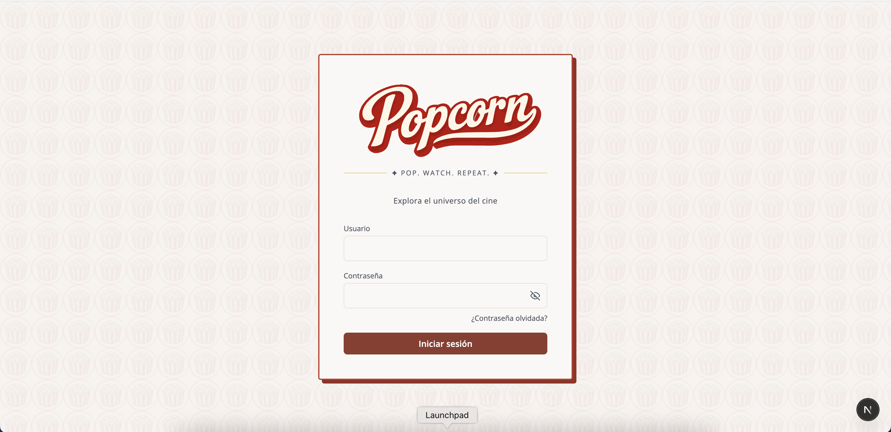

---

## About this project

Popcorn is a full-stack personal dashboard built to demonstrate modern web development practices with **Next.js 16** and **TypeScript 5**.

### Tech choices

**Next.js App Router + React 19** — the app uses the App Router with a clear separation between Server and Client Components. The persistent dashboard layout is a Server Component that decodes the JWT cookie to read the user role, passing it down to a client layout via React Context. Each page has a role-aware loading skeleton that renders immediately during bundle download so the UI is never blank.

**Self-hosted auth (no third-party provider)** — users are stored in a local SQLite database (better-sqlite3), passwords hashed with bcrypt and sessions managed with short-lived JWTs (jose, Edge Runtime compatible). Access tokens expire after 1 hour; a refresh token (7 days) allows silent renewal via an `apiFetch` wrapper that retries on 401 automatically.

**Role-based access control** — two roles (admin / guest) enforced at every layer: middleware (JWT verification, route protection), API route handlers (`requireAdmin` guard), and UI (conditional rendering, hidden controls).

**TanStack Query for server state** — all TMDB data goes through `useQuery` with structured cache keys (`['movie-detail', id, language]`). Language changes automatically invalidate the cache. Mutations (user management) use `useMutation` with optimistic cache invalidation.

**Client-side persistence with Zustand** — watched movies and episodes, ratings, language and theme preferences are all stored per user in localStorage via Zustand persist stores. An `ssrStorage` adapter prevents hydration mismatches in Next.js SSR.

**Testing strategy** — unit and integration tests with Jest + Testing Library cover pure functions, stores, hooks and components. End-to-end tests with Cypress cover full user flows (auth, movies, series, user management, settings) against a live dev server with a real SQLite database.

**CI pipeline** — GitHub Actions runs TypeScript check, ESLint, Jest and a Next.js production build on every push, followed by a full Cypress E2E run against the production build. Merges to `main` additionally push a Docker image to ghcr.io and create a versioned GitHub Release with auto-generated changelog.

**Local-first by design** — the app runs entirely on your machine. User data is stored in a local SQLite database, watched history and preferences in localStorage. There is no cloud deployment or external backend — this keeps the setup self-contained and the focus on the front-end and full-stack architecture rather than infrastructure.

### AI-assisted development

This project is being built with **[Claude Code](https://claude.ai/code)** (Anthropic) as an AI pair programmer. All product, design and architecture decisions are made by the developer — what to build, how to structure it, which trade-offs to accept and how the UI should behave. Claude assists with implementation, flags potential issues and suggests improvements during development. This workflow reflects how modern development teams are increasingly integrating AI tools into their day-to-day engineering process without transferring ownership of technical judgement.

---

## Getting started

### Step 1 — Prerequisites

You need **Node.js** (which includes npm) installed on your machine.

#### Check if you already have it

Open a terminal and run:

```bash
node -v
npm -v
```

If both commands print a version number (e.g. `v22.0.0` and `10.0.0`) you are ready — skip to [Step 2](#step-2--download-the-project).

#### Install Node.js

Go to [nodejs.org](https://nodejs.org) and download the **LTS** version for your operating system. Run the installer and follow the prompts. Once installed, close and reopen your terminal, then verify with `node -v` and `npm -v`.

> The app requires Node.js 18 or newer.

---

### Step 2 — Download the project

#### Option A — Git clone (recommended)

If you have Git installed:

```bash
git clone https://github.com/AdrianaVent/popcorn.git
cd popcorn
```

To check if Git is installed run `git --version`. If it is not, download it from [git-scm.com](https://git-scm.com).

#### Option B — Download ZIP

1. Go to the repository page on GitHub
2. Click the green **Code** button → **Download ZIP**
3. Extract the ZIP file
4. Open a terminal and `cd` into the extracted folder

---

### Step 3 — Install dependencies

Inside the project folder run:

```bash
npm install
```

This downloads all libraries listed in `package.json`. It may take a minute.

> **Note on deprecation warnings** — you may see `npm warn deprecated` messages for packages like `inflight` or `whatwg-encoding`. These come from transitive dependencies inside Jest and jsdom and are outside our control. They do not affect functionality, the build, or the tests.

---

### Step 4 — Configure environment variables

Copy the example env file:

```bash
cp .env.local.example .env.local
```

Open `.env.local` in any text editor and fill in the two required values:

```env
NEXT_PUBLIC_TMDB_API_KEY=   # your TMDB API key — free at themoviedb.org
JWT_SECRET=                 # any long random string — run: openssl rand -base64 32
```

**Getting a TMDB API key:**

1. Create a free account at [themoviedb.org](https://www.themoviedb.org)
2. Go to **Settings → API** and request an API key (select "Developer")
3. Copy the **API Key (v3 auth)** value

**Generating a JWT secret** (macOS / Linux):

```bash
openssl rand -base64 32
```

On Windows you can use any long random string, for example one generated at [randomkeygen.com](https://randomkeygen.com).

---

### Step 5 — Create your first admin user

```bash
npm run seed
```

This creates a default admin account: `admin` / `Admin123!`

To choose your own credentials:

```bash
npm run seed <username> <password>
```

> Passwords must be at least 8 characters and include one uppercase letter, one number and one special character (e.g. `!`, `@`, `#`).

**Create a guest user to explore the full experience**

The admin role cannot mark movies as watched, rate titles or use My list — those features are guest-only. To try everything the app offers, sign in as admin, go to **Users → Add user**, and create an account with the **Guest** role. Then log out and sign in with the new credentials.

---

### Step 6 — Start the app

```bash
npm run dev
```

Open [http://localhost:3000](http://localhost:3000) in your browser and sign in with the credentials you created in the previous step. After login you land on the Home dashboard.

---

## User Manual

---

### Home (`/home`)

The landing page after login. It shows three cards in a responsive grid: a Top 10 ranking, a genre distribution chart, and a release calendar. The grid adapts to the available width — cards stack in a single column on narrow viewports, two columns on medium widths, and all three side by side on wide screens.

**Top 10**

A ranked list of the top 10 movies or series by rating. Each entry shows the poster, title, release year, genre icons and score.

- Use the **My profile / Global** toggle to switch between your personal watched history and the full TMDB catalogue.
- Filter by genre using the genre picker in the card header.
- The toggle is not available for admin accounts — admins always see the global view.
- Click any entry to open its detail modal.

**Genre distribution**

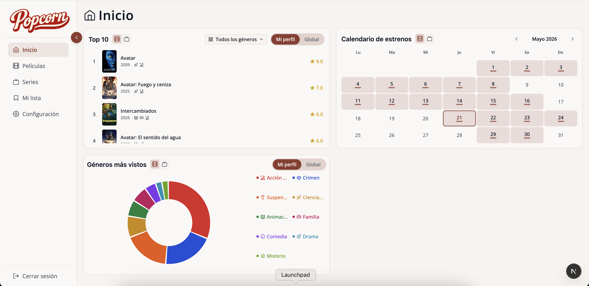

A donut chart showing which genres appear most — either in the TMDB catalogue or in your own watched history. The legend lists all genres with their colour; hover a slice or a legend item to highlight it and see the percentage.

- Use the **My profile / Global** toggle (top-right) to switch data source.
- Switch between **Movies** and **Series** with the icon buttons in the card header.
- The toggle is not available for admin accounts — admins always see the global view.

**Release calendar**

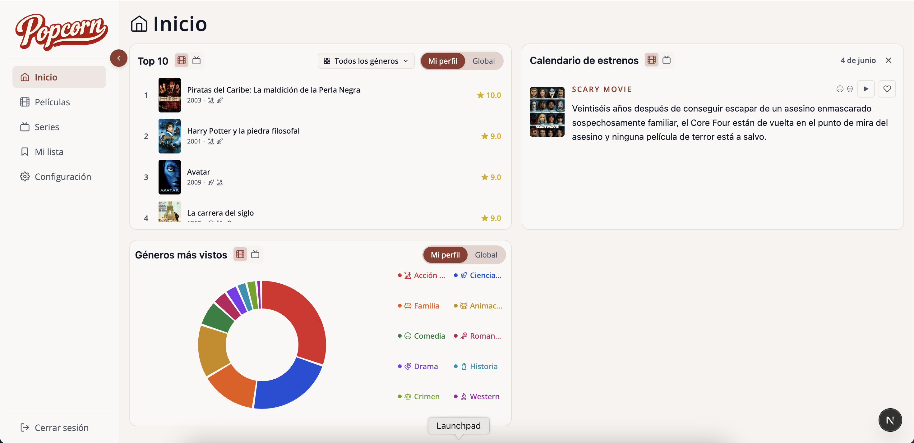

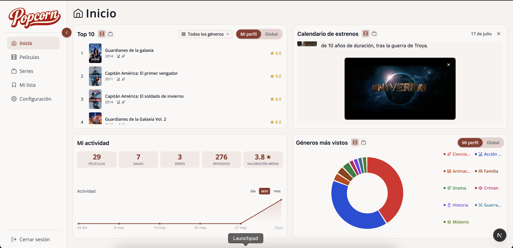

A monthly calendar showing upcoming movie and series releases from TMDB (English and Spanish titles).

- Days with at least one release are marked with a coloured dot.
- Click a day to open a panel listing all releases for that date.
- Click any entry in the panel to open its detail modal.
- Click the play button on an entry to watch its trailer inline (series entries prefer the season-specific trailer, falling back to the series trailer).
- Use the **←** and **→** arrows to navigate between months. The **Today** button returns to the current month.
- Switch between **Movies** and **Series** with the icon buttons in the card header.

---

### Movies (`/movies`)

A paginated table of movies from TMDB, sorted by popularity by default.

**Browsing and filtering**

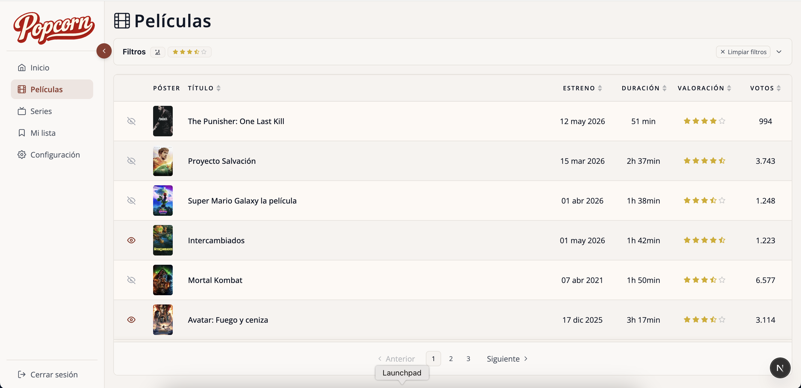

The **Filters** panel sits at the top of the page. Click the chevron on the right to collapse it — when collapsed, any active filters are shown as summary pills in the header so you can see what is applied at a glance. Click **Clear filters** to reset everything without having to expand the panel first.

Use the filters to narrow the list:

| Filter | How it works |
|---|---|
| Title | Searches TMDB in real time. Sorting is disabled while a search is active. |
| Rating ≥ | Drag or click a star value. Only titles rated at or above the threshold are shown. |
| Runtime ≥ | Enter a value and choose the unit (d / h / min). The filter converts automatically to minutes. |
| Year | Shows titles released in that calendar year. |
| Language | Filters by original language (English or Spanish). |
| Genres | Multi-select genre picker. Select one or more genres to filter by. |
| Platform | Shows titles available on a specific streaming service in Spain. |
| Watched | Switch between **All**, **Watched** and **Unwatched** (guest only). |

**Sorting**

Click a column header to sort by that field. Click again to reverse the order. Sorting by title loads all matching pages from TMDB and sorts them client-side (TMDB does not support server-side title sort reliably).

**Marking a movie as watched** *(guest only)*

Movies you have marked as watched show a diagonal **Watched** ribbon on their poster thumbnail. Mark or unmark them from the detail modal (see below).

**Opening the detail modal**

Click anywhere on a row to open a panel with full information about the movie.

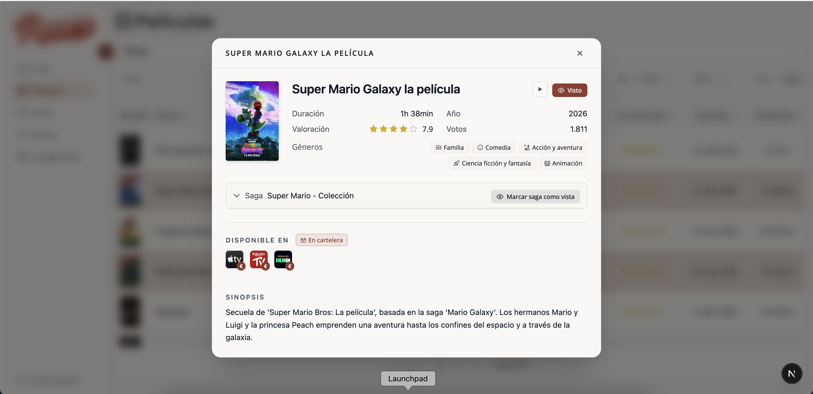

The modal shows the **synopsis**, **genres**, **runtime**, **release year**, **vote count** and **watch providers** — where the title is available in Spain (subscription, rental, purchase).

- Mark the movie as **watched / unwatched** with the button next to the title *(guest only)*.
- Click the play button next to the title to watch the official trailer inline. Click it again or use the **×** button on the player to close it.
- The TMDB rating is displayed as stars (0.5–5 scale).

**Sagas**

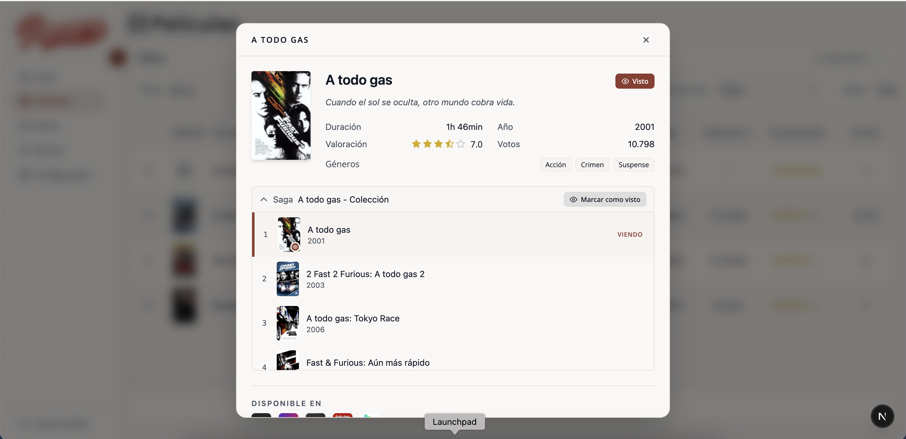

If the movie belongs to a collection, a **Saga** accordion lists all released films in the series (future or undated instalments are omitted). Click any title to navigate to that film without closing the modal. The accordion marks which films you have already watched and lets you mark the entire saga as watched in one click. Each film has a play button to watch its trailer inline.

**Movies currently in cinemas**

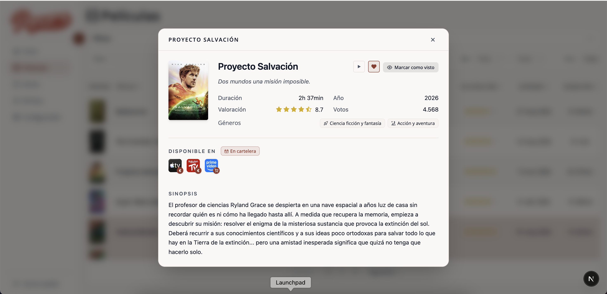

Movies released in Spanish cinemas within the last 90 days show an **In theaters** chip next to the streaming platform badges.

---

### Series (`/series`)

Works the same way as the Movies section — same filters, sorting, watched ribbon on the poster and export button — with one addition: episode-level tracking.

The **Watched** filter and the watched ribbon are available to guest accounts only. The **Export** button is available to admin accounts only.

**Browsing and filtering**

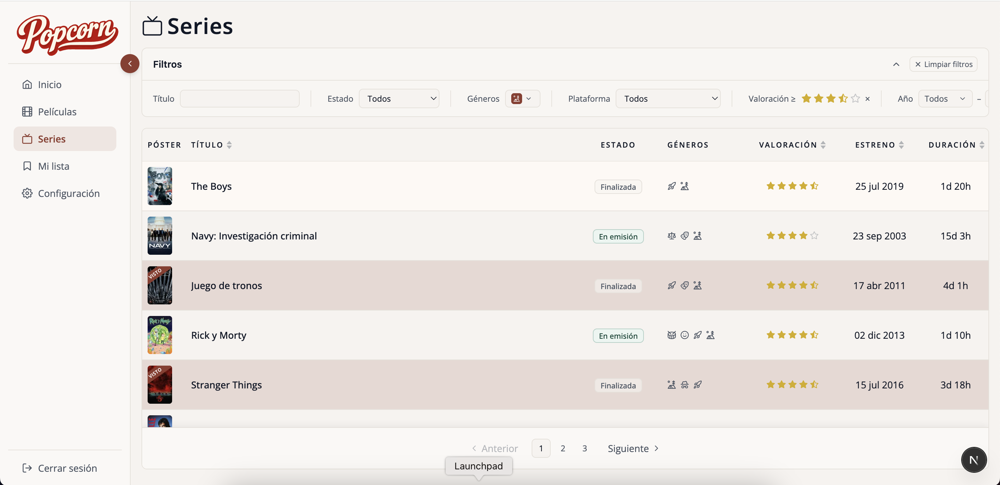

The series list includes a **Status** filter (airing, ended, cancelled...) not available in Movies. All other filters work identically.

**Opening the detail modal**

Click anywhere on a row to open a panel with full information about the series.

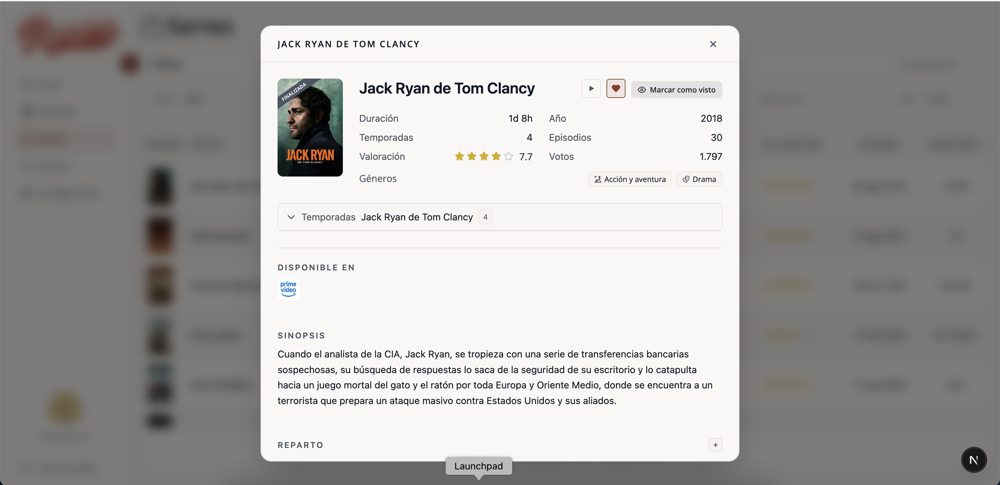

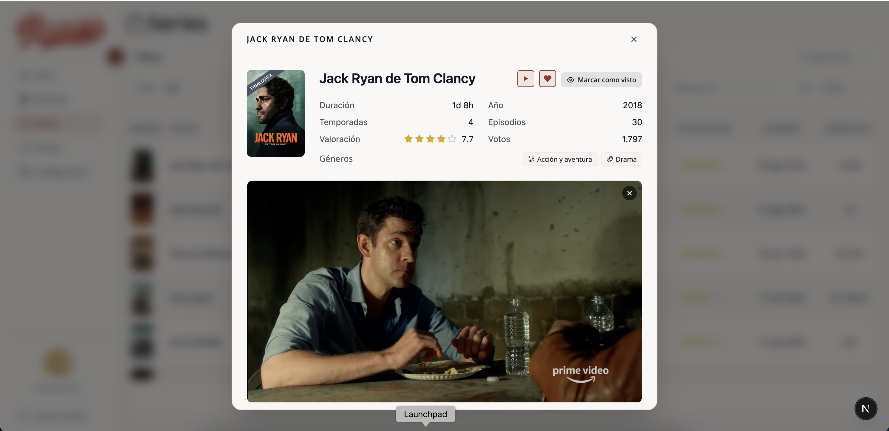

The modal shows the **synopsis**, **genres**, **episode runtime**, **status**, total number of **seasons and episodes**, and **watch providers**. Mark the series as watched with the button next to the title *(guest only)*. Click the play button next to the title to watch the official trailer inline. Click it again or use the **×** button on the player to close it.

**Episode tracking** *(guest only)*

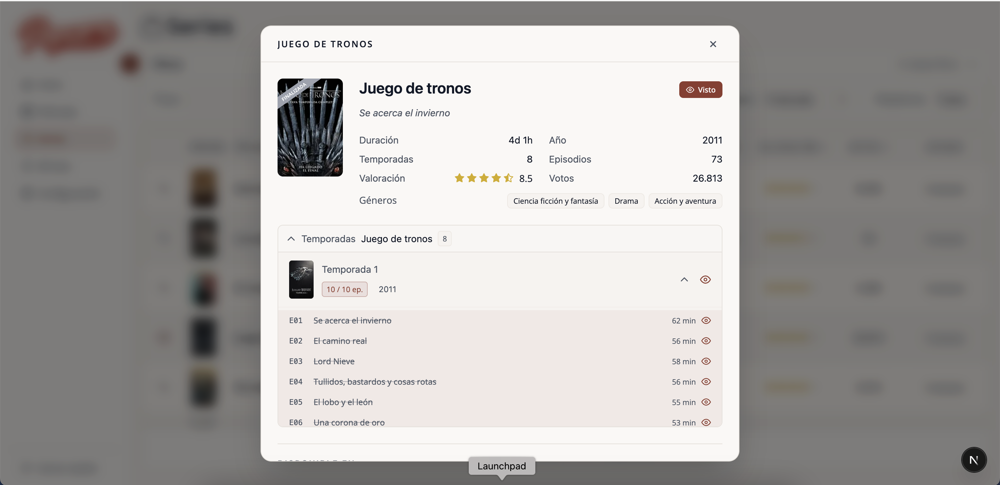

Expand the **Seasons** accordion to see the full episode list broken down by season.

- Click the eye icon next to an episode to mark it as watched individually.
- Click the eye icon next to the season header to mark all available episodes in that season at once (future air dates are excluded).
- Click the season eye icon again to unmark the entire season.
- Click the play button in the season header to watch the season trailer inline. The app first looks for a dedicated season video; if none exists, it falls back to any series-level trailer whose YouTube title contains "Season X" or "Temporada X". Specials (Season 0) are hidden.

---

### My list (`/my-list`) — guest only

A personal overview of everything you have marked as watched, plus a dedicated watchlist for titles you plan to watch. Admin accounts do not have access to this section.

The page has three tabs — **Movies**, **Series**, and **Watchlist** — each showing a count badge. Badges cap at 99 and display the exact count in a tooltip when above the cap.

**Movies tab**

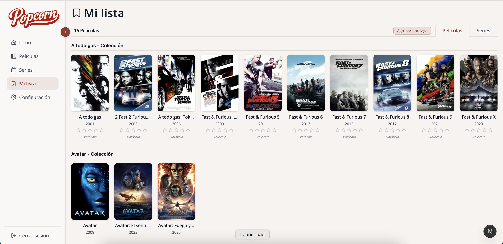

Displays your watched movies as cards (poster, year, star rating and a Recommendations button). The layout adapts dynamically:

- Movies that belong to the same collection are automatically grouped under a shared **Saga** card (e.g. "Harry Potter - Saga"), with films sorted in release order inside. Collections with only one released film are shown as regular standalone cards instead.
- Saga cards show **all released films** in the collection — not just the ones you have watched. Films you have not yet watched appear as dimmed placeholder slots, sorted in release order. Clicking a placeholder opens the detail modal so you can learn more or mark it as watched. Future or undated instalments are omitted.
- Saga cards are laid out using a **bin-packing algorithm** that fills available horizontal space across rows, keeping the first saga in its position and fitting subsequent sagas into any gap before opening a new row.
- Standalone films appear under a separate "Standalone films" label.
- The section order (sagas first vs. standalone first) is driven by the most recent addition — whichever you marked last appears at the top.
- Click the stars on any card to rate it from 0.5 to 5.

**Series tab**

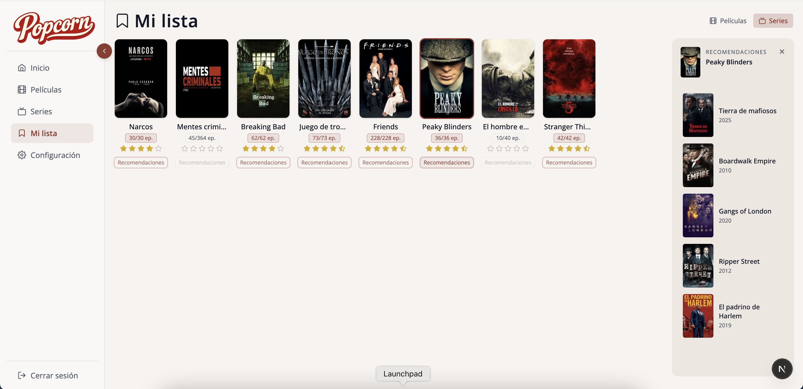

Displays your watched series as cards. Each card shows an episode progress badge (e.g. `1/62 ep.`), a star rating and a Recommendations button.

- The star rating is always visible but non-interactive until the series is complete.
- The Recommendations button is disabled while a series is in progress or when complete but not yet rated at ≥ 3.5★. Hovering the button shows the reason.
- Once a series is complete and rated at ≥ 3.5★, the button becomes active.

**Watchlist tab**

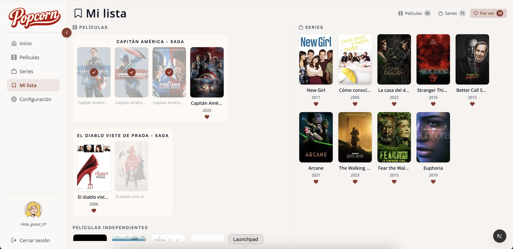

A watchlist of titles you want to watch later. Add titles via the heart (♥) button in the movie/series detail modals or in the release calendar. Items are automatically removed from the list when you mark them as watched.

The tab is split into two columns — Movies on the left and Series on the right. Movies that belong to a saga are grouped together, with each film showing one of three states: watched (dimmed ✓), in watchlist (heart card with remove button), or not yet added (dimmed placeholder).

**Recommendations**

Each standalone movie card has a **Recommendations** button; saga cards share one button for the whole group. When you have rated the title (or the best-rated film in a saga) at 3.5 stars or above, clicking the button opens a right-side drawer showing up to 5 TMDB recommendations. Already-watched titles are excluded from the results. Click any recommendation to open its detail modal. The Series tab works the same way. When the drawer opens, the list automatically scrolls to center the selected card in view.

Ratings are stored locally per user — they are not sent to TMDB.

---

### Export *(admin only)*

Available from the **Movies** and **Series** pages via the export button in the top-right corner.

- **JSON** — raw TMDB data for all titles matching the current filters.
- **CSV** — human-readable format (formatted dates, rating as `X / 10`, vote count with thousands separator). Optimised for Excel and LibreOffice (UTF-8 BOM included).

The export always fetches all pages before downloading — the file contains the full result set, not just the current page.

---

### User management (`/users`) — admin only

A paginated list of all user accounts.

**Browsing and filtering**

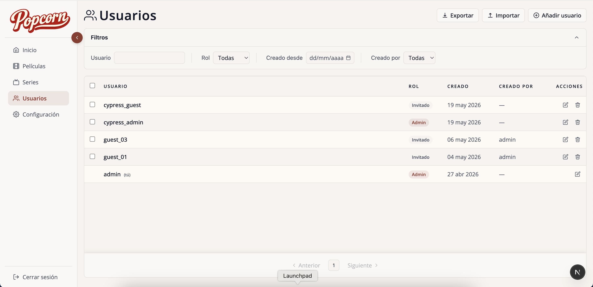

Use the filter panel to search by username, role, creation date or creator (the admin who created the account).

**Creating a user**

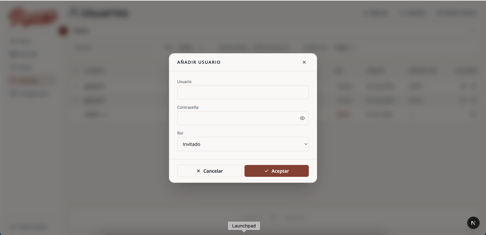

Click **Add user**, fill in the username, password and role (admin or guest), and confirm. The new user appears immediately in the list.

> Password requirements: at least 8 characters, one uppercase letter, one number and one special character.

**Editing a user**

Click the edit icon on any row to open a form with the current values pre-filled. Leave the password field blank to keep the existing password.

**Deleting users**

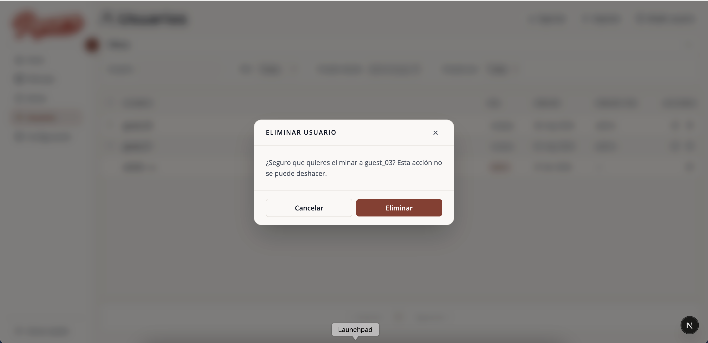

- Click the delete icon on a row to delete a single user. A confirmation dialog will appear before the action is executed.
- Select multiple rows using the checkboxes and click **Delete selected** for a bulk deletion.

Admins cannot delete or change the role of their own account.

**Importing users in bulk**

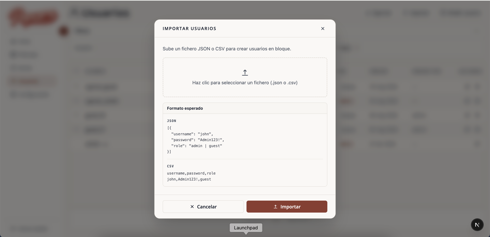

Click **Import** to upload a JSON or CSV file and create multiple accounts at once. Expected formats:

```json
[{ "username": "...", "password": "...", "role": "admin|guest" }]
```

```
username,password,role
alice,Pass123!,guest
bob,Pass456!,admin
```

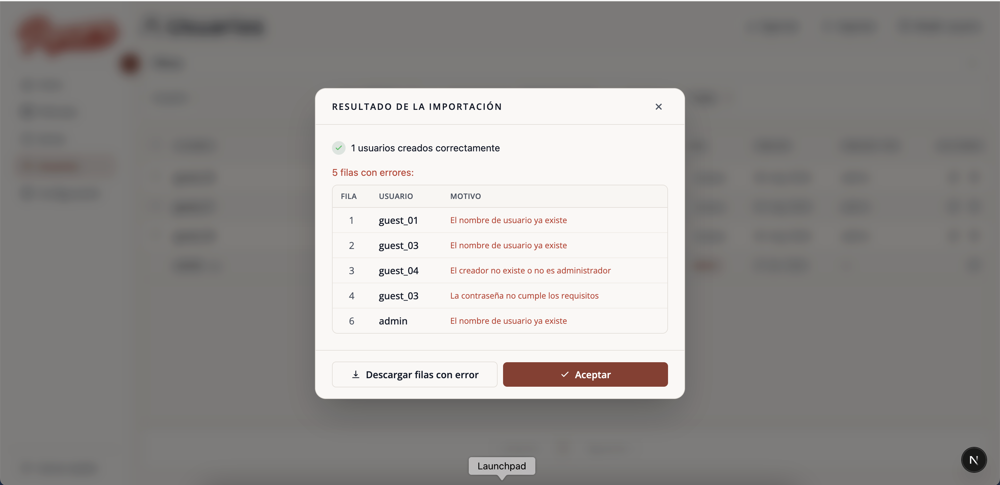

After processing, a results screen shows how many accounts were created and lists any rows that failed with the reason for each error. Failed rows can be downloaded as a CSV for correction and re-upload.

---

### Settings

Click the gear icon in the sidebar to open the settings panel.

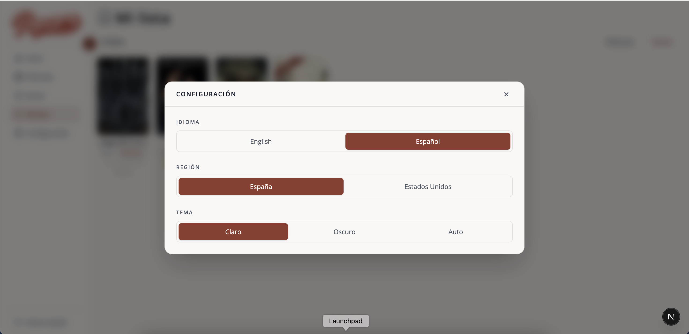

- **Language** — switch between English and Spanish. Defaults to Spanish on first login. The preference is stored per user in localStorage and applied immediately across the entire interface with no page reload — i18next resolves the stored language before the first render to avoid any visible flash.
- **Region** — switch between Spain and United States. Determines which streaming platforms are shown in the watch providers section of every movie and series detail modal.
- **Theme** — choose Light, Dark or Auto. The Auto mode resolves the theme based on time of day (light from 7am to 7pm, dark otherwise) without requiring any user interaction. All three preferences are persisted in localStorage and restored across sessions.

---

### Session management

The access token expires after 1 hour. When that happens the app automatically requests a new token in the background — the current action is retried transparently and you will not be interrupted. If the refresh also fails (e.g. the refresh token has expired after 7 days), you are redirected to the login page.

---

## Running tests

The project has two test layers: **669 unit/integration tests** (Jest) and **141 end-to-end tests** (Cypress). Both run automatically in CI on every push.

### Unit & integration tests (Jest) — 669 tests · 59 suites

```bash
npm test           # run once
npm run test:watch # watch mode
```

| Area | What's covered |
|---|---|
| Pure functions | `getMovieUI`, `getSeriesUI`, `formatDate`, `formatVoteCount`, `deduplicateProviders`, `buildGenreCounts`, `toCSV`, `pickYouTubeTrailer`, `findSeasonTrailerInList`, `filterNonSeasonTrailers`, `resolveSeasonFallback`, `resolveHeaderTrailer` |
| Business logic | Client-side filters (movies + series), TMDB fetch error mapping, export utilities |
| Stores | `watchedStore` (toggle movie/episode, season counts, auto-remove from watchlist), `watchlistStore` (toggleMovie/toggleSeries, removeMovie/removeSeries, per-user isolation), `toastStore` (queue, timers), `ratingsStore` (per-user isolation) |
| Hooks | `useMovieDetail`, `useSeriesDetail`, `useWatchProviders`, `useMovieInTheaters`, `useMovieReleases`, `useSeriesReleases`, `useTrailer` (language preference, YouTube filtering, allTrailers list), `useEnrichedTrailers` (YouTube oEmbed title enrichment, 24h cache), `useSeriesEnrichment` (status/totals/runtimes/genreIds backfill, stable-reference pattern), `useMovieRuntimeEnrichment` (Promise.allSettled backfill, null on fail), `useFilters` (initial state, setFilters, reference identity) |
| Components | `Button`, `Modal`, `FiltersPanel`, `StarRating`, `ConfirmModal`, `UserFormModal`, `ImportModal`, `WatchProviders`, `MediaPoster`, `ReleaseCalendar`, `CalendarReleaseItem` (heart visible/hidden by role and watched state), `ErrorBoundary`, `ToastItem`, `ContentTabToggle`, `GenreGrid` (name deduplication), `TrailerPlayer` (iframe, close button), `SearchableSelect` (open/close, search, selection, clear), `YearRangePicker` (cross-filtering, null callbacks), `FilterFieldInput` (all field types, null guards), `ToggleSwitch` (active style, onChange, role="group"), `MediaTableCells` (TitleCell tooltip guard, GenresCell deduplication by icon), `StatusBadge` (all status variants) |
| Services | `apiFetch` (401 auto-refresh, session expiry redirect) |
| API routes | `/api/users/import` (field validation, role/password rules, duplicates, invalid creator/date) |

### End-to-end tests (Cypress) — 141 tests · 7 suites

In CI, Cypress runs against the production build automatically. Locally, run against the dev server:

```bash
# Terminal 1
npm run dev

# Terminal 2 — interactive UI
npm run cypress

# Terminal 2 — headless
npm run cypress:run
```

| Suite | Tests | What's covered |
|---|---|---|
| `auth.cy.ts` | 6 | Redirect when unauthenticated, invalid credentials, login, logout, session expiry |
| `home.cy.ts` | 26 | Genre charts, tab switch, My profile/Global toggle, empty state, release calendar, Top 10 year display, calendar trailer button, Top 10 genre filter dropdown, calendar watchlist button (admin: hidden; guest: visible) |
| `movies.cy.ts` | 36 | Movie list, detail modal, watch providers, genre multi-select filter, platform filter, star rating filter, genre deduplication, access control, trailer (show, open, close, X button), column sort (rating asc/desc), runtime filter (2h → 120min, 90min), watchlist heart button (guest: visible + gains active style on click; admin: hidden) |
| `series.cy.ts` | 31 | Series list, detail modal, watch providers, genre multi-select filter, platform filter, star rating filter, genre deduplication, episode runtime guard, trailer (show, open, close, X button), column sort (rating asc/desc), runtime filter client-side (filters below total duration threshold, not sent to TMDB), watchlist heart button (guest: visible + gains active style on click; admin: hidden) |
| `users.cy.ts` | 15 | Create, edit, delete (single + bulk), toasts, import JSON/CSV, partial failures |
| `my-list.cy.ts` | 25 | Tabs, empty state, nav access control, watched movie, Recommendations button (disabled/enabled), saga name formatting, single-released-movie collection as standalone, section ordering (standalone-first/saga-first), series tab + episode progress, "Finish to rate", recommendations drawer, unwatched saga placeholders, future-date filter regression, click placeholder opens modal, Watchlist tab (visible, empty state, movie/series visible, count badge, remove on heart click) |
| `settings.cy.ts` | 3 | Theme switching (light / dark), language switching (EN / ES) |

Cypress creates and cleans up its own test users in the local database automatically. TMDB calls are intercepted — no real API key needed to run the E2E suite.

---

## Docker

You can run Popcorn in a container without installing Node.js or configuring a local database.

### Prerequisites

- [Docker](https://www.docker.com/) installed and running
- `.env.local` configured (same file used for local development — see [Getting started](#getting-started))

### Run with Docker Compose

If you haven't already, copy the example env file and fill in your values:

```bash
cp .env.local.example .env.local
```

Then start the container:

```bash
docker compose --env-file .env.local up --build
```

The `--env-file` flag is required so Docker can read your API key at build time — `NEXT_PUBLIC_TMDB_API_KEY` is baked into the client bundle during the build step and is not injectable at runtime.

Open [http://localhost:3000](http://localhost:3000). On first run the database is created automatically and a default admin user is seeded:

| Field | Default |
|---|---|
| Username | `admin` |
| Password | `Admin123!` |

You can override the default credentials via environment variables in `.env.local`:

```
ADMIN_USERNAME=myadmin
ADMIN_PASSWORD=MyPassword1!
```

The database is stored in a Docker volume (`popcorn_data`) and persists between container restarts.

> **Note on the TMDB API key** — `NEXT_PUBLIC_TMDB_API_KEY` is baked into the client bundle at build time. If you change it you must rebuild the image (`docker compose up --build`).

### Useful commands

```bash
docker compose --env-file .env.local up --build   # build and start
docker compose --env-file .env.local up -d        # start in background
docker compose down                               # stop and remove container
docker compose down -v                            # stop and delete data volume (resets the database)
```

---

## All commands

| Command | Description |
|---|---|
| `npm run dev` | Start development server |
| `npm run build` | Production build |
| `npm run start` | Start production server |
| `npm test` | Run Jest unit tests |
| `npm run test:watch` | Jest in watch mode |
| `npm run cypress` | Open Cypress UI |
| `npm run cypress:run` | Run E2E tests headlessly |
| `npm run lint` | ESLint check |
| `npm run lint:fix` | ESLint auto-fix |
| `npm run format` | Prettier format |
| `npm run seed` | Create default admin user |

---

## Project structure

```
src/
├── app/api/auth/       # login · logout · refresh — thin Route Handlers
├── components/
│   ├── common/         # FiltersPanel, ExportButton, Sidebar, SettingsModal, ...
│   ├── layouts/        # AuthLayout, DashboardLayout, PageLayout
│   └── ui/             # Button, Input, Text, Modal, ModalFooter, Header,
│                       # DatePicker, ConfirmModal, IconButton, IconToggleButton, Table/, LoadingOverlay,
│                       # Toast/ToastItem, Toast/ToastContainer, BarChart, ToggleSwitch,
│                       # SearchableSelect, YearRangePicker, FilterFieldInput,
│                       # StarRating, Tooltip, TrailerPlayer, ...
├── config/             # auth.ts · tmdb.ts · i18n.ts · constants.ts
├── db/                 # client.ts (SQLite singleton) · users.ts (typed queries)
├── features/
│   ├── auth/login/     # LoginFeature · useLogin · login.service.ts
│   ├── home/           # HomeFeature · useMovieGenres · useSeriesGenres · ReleaseCalendar · CalendarReleaseItem
│   ├── movies/         # MoviesFeature · hooks · components · service
│   ├── myList/         # MyListFeature · MovieCard · SeriesCard · RecommendationsDrawer (tabs, saga grouping, watchedAt ordering, ratings)
│   ├── series/         # SeriesFeature · hooks · components · service
│   └── users/          # UsersFeature · UserFormModal · ImportUsersModal · users.service.ts
├── hooks/              # useFilters · useWatchProviders · useTruncated · useTrailer · useEnrichedTrailers
├── locales/            # en.json · es.json
├── middleware.ts        # JWT verification + route protection
├── providers/          # GlobalProvider · ThemeProvider · LanguageProvider
├── services/
│   ├── apiFetch.ts     # fetch wrapper — auto-refresh on 401, redirect to /login on expiry
│   ├── auth/           # authService — bcrypt verify, JWT sign/refresh
│   └── tmdb/           # TMDB client — movies, series, search
├── store/              # themeStore · languageStore · userStore · watchedStore · watchlistStore · ratingsStore · toastStore
└── utils/              # formatDate · formatNumber · exportData · getTMDBImageUrl · ...
cypress/
├── e2e/                # auth · home · movies · series · my-list · users · settings
├── fixtures/           # mocked TMDB responses
└── support/            # commands.ts (cy.login) · e2e.ts (global hooks)
scripts/
├── seed.ts             # Creates an admin user (local dev)
└── docker-seed.js      # Creates admin user on first Docker run (CommonJS, no TS)
data/
└── popcorn.db          # SQLite database — gitignored, auto-created on first run
Dockerfile              # Multi-stage build: deps → builder → runner (Node 20 Alpine)
docker-compose.yml      # Compose with persistent volume for the database
docker-entrypoint.sh    # Seeds DB if absent, then starts the app
```

---

## Tech stack

| | |
|---|---|
| Framework | Next.js 16 + React 19 (App Router) |
| Language | TypeScript 5 |
| Styling | Tailwind CSS 4 + PostCSS |
| State | Zustand 5 — persisted in localStorage |
| Server state | TanStack Query 5 — caching, background refetch |
| i18n | i18next + react-i18next — English / Spanish |
| Auth | jose (JWT) · better-sqlite3 · bcryptjs |
| Unit tests | Jest 30 + Testing Library |
| E2E tests | Cypress 15 |
| Linting | ESLint 9 + Prettier |
| CI/CD | GitHub Actions — tsc, lint, jest, build + Cypress E2E on every push; Docker publish + GitHub Release on `main` |
| Docker | Multi-stage image (Node 20 Alpine, ~200 MB via standalone output) — non-root user, healthcheck, auto-seeds DB on first run; published to ghcr.io on `main` |

---

## Git workflow

```
feature → dev → main
```

- Feature branches are always cut from `dev`
- Before a PR: `npm test` + `tsc --noEmit` + `npm run lint` must all pass
- After merging to `dev`: run build-check — only then merge `dev` into `main`
- `main` is always stable and production-ready
